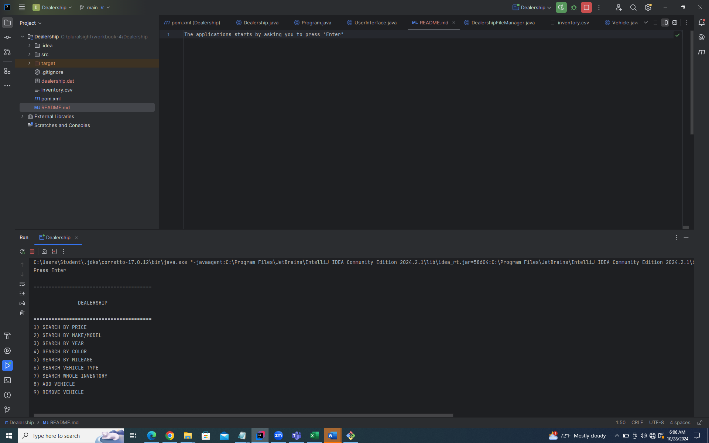
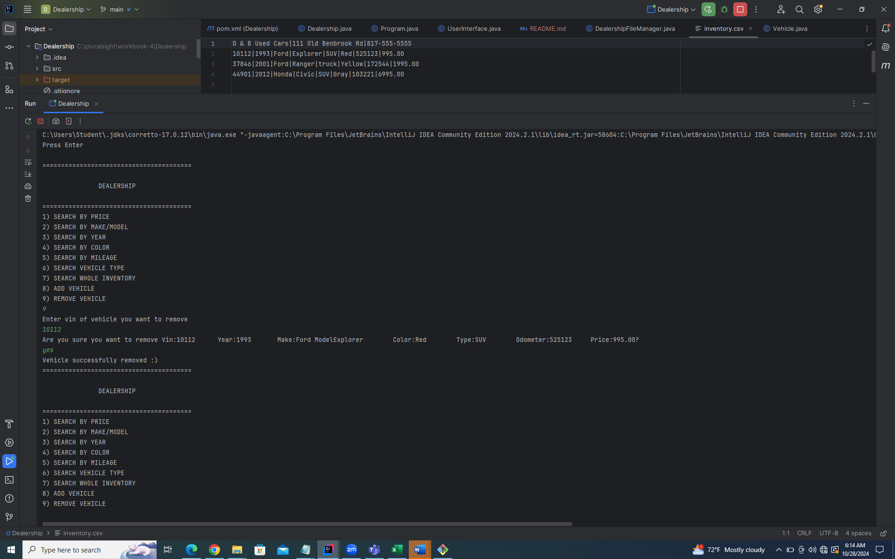

The applications starts by asking you to press "Enter"

Once you press enter the Dealership app options will display where you can search for the vehicle by
price, make, model, year, color, vehicle type, or through the inventory.

The app also allows you to add your vehicle into the inventory by prompting you for all the info.

When you want to remove a vehicle from the inventory simply select option nine which asks you to select which vehicle by Vin # 
Once you have entered the vin number it will make sure that is the vehicle you would like to remove and if you type yes and enter
it will notify you that is done.

